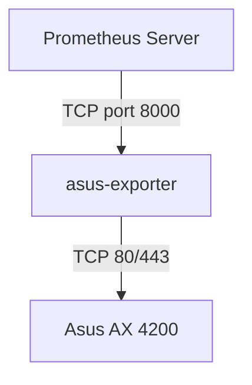

# What is this
- Exporter to expose EX4200 metrics in a Prometheus/Openmetrics format
- https://itnext.io/monitor-your-asus-router-in-python-171693465fc1




### Building the exporter
```
docker build . -t asus-exporter
```

### Running the exporter
```
docker run -e ASUS_USERNAME=admin -e ASUS_PASSWORD=potato -e ASUS_IP=192.168.50.1 -p 8000:8000 --name asus-exporter asus-exporter
```


