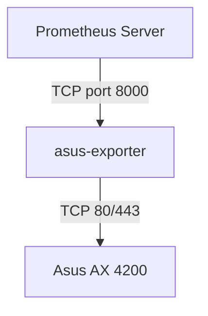

# What is this
- Exporter to expose EX4200 metrics in a Prometheus/Openmetrics format
- https://itnext.io/monitor-your-asus-router-in-python-171693465fc1

```mermaid
  graph TD;
      A["Prometheus Server"]-->|TCP port 8000| B["asus-exporter"];
      B --> |TCP 80/443| C["Asus AX 4200"]
```